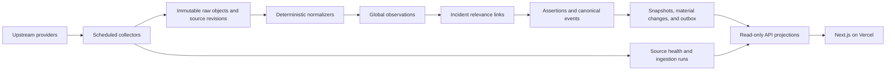

# Production Architecture

**Status:** production foundation deployed; shadow integration in progress
**Updated:** 30 July 2026

## Purpose

Evolve the Plomari incident map into a global, multi-incident wildfire
intelligence platform without weakening its public-safety semantics.

God's Eye is an inspiration for breadth of situational data and map interaction.
It is not the backend design. This project owns collection, provenance,
normalization, incident relevance, reconciliation, and public read models so
that every displayed claim can be traced to durable evidence.

## Non-negotiable safety invariants

- Only a validated, authorized official source can create a protective action.
- Publisher, social, model, and satellite data cannot become an official
  instruction through classification or corroboration.
- A thermal point is not a flame location, fire perimeter, spread vector, or
  count of fires.
- A model is not an observation. Modeled weather, smoke, and scenarios remain
  visibly distinct from measurements.
- No detections, an unavailable feed, and an explicit observed absence are
  different states.
- Corrections and retractions append new evidence; they never rewrite history.
- Incident relevance is recorded separately from an observation. One global
  observation may be relevant to several incidents or to none.
- The public API serves reviewed projections, not raw upstream payloads or
  operational tables.

## Runtime topology

Collection is independent of public requests. Vercel renders and serves the
product, while scheduled workers collect and transform upstream data through
server-only credentials. Supabase Postgres/PostGIS is the system of record;
the private `raw-evidence` Storage bucket retains larger raw objects at paths
derived from their SHA-256 digest. Runtime roles may insert and read those
objects but cannot overwrite or delete them. Collectors verify bytes against
the digest on write and read; retention deletion is a separately authorized,
audited operator action governed by each source's terms.

Evidence reconstructs the credential-redacted application request and response,
not a replay-ready HTTP wire message. Exact small bodies use database-verified
`inline_bytes`. Large bodies use content-addressed Storage objects whose bytes
and byte count are verified by the collector; PostgreSQL can enforce the path
but cannot inspect Storage bytes. `inline_payload` is instead a PostgreSQL
`jsonb` semantic value whose database-verified digest covers normalized
`jsonb::text`, so it does not identify the upstream JSON serialization.

## Source identity model

The same provider can publish products with different semantics, licensing,
cadence, credentials, and geographic scope. These are separate concepts:

| Concept | Example | Owns |
| --- | --- | --- |
| Provider | NASA, NOAA, a national fire service | organization identity and default attribution |
| Endpoint/product | FIRMS Area API, NWS alert feed | data semantics, authority scope, adapter release, terms |
| Collection target | a global dataset, station, feed, account, or bounding area | request configuration, cadence, freshness, enabled state |
| Incident binding | target attached to one incident | purpose, priority, relevance configuration |

Credentials are references on server-side endpoint configuration, never
credential values in database rows returned to clients.

## Evidence and incident model

Raw retrievals and source revisions are immutable. A successful or failed
collection attempt records timing, status, safe error classification, and the
collection target. Normalized observations are global and keep their original
event time, publication time, retrieval time, geometry precision, measurements,
quality fields, parser release, and validation state.

Incident relevance is an append-only link. It records the method, rationale,
distance where applicable, and the exact version and geometry of the incident
area used during evaluation. Expanding or correcting an incident area therefore
does not silently change the historical explanation for an earlier match.

Current incident state is a projection over evidence-backed events. Material
changes retain before/after state, rule version, and evidence links. Cursor
ordering uses stable keys rather than locale-dependent comparison.

## Temporal exploration

The map has an explicit **Live** position and an **as-of** scrubber. Rewinding
selects an effective/observation instant; it never changes an item's source
timestamp or pretends the latest response was available earlier. Parameterized
read functions also accept a separate knowledge cutoff so an operator can
distinguish corrected history (“what we now know about that time”) from audit
replay (“what the system had recorded by then”).

- Observations, events, snapshots, material changes, and publication actions
  are filtered using their structured time precision and recorded-at clock.
- Retractions and corrections are resolved as of the knowledge cutoff rather
  than applied retroactively to an audit replay.
- Date-only and unknown-time records are never placed at a fabricated instant;
  the interface groups them separately when they are relevant to the selected
  day.
- Present-only values such as current board status, live modeled wind, and
  current source health are hidden or labeled current-only while rewound.
- Thermal and other dense sensor layers use a bounded lookback window ending
  at the selected instant; the backend paginates rather than returning an
  incident's entire history to the browser.

The first snapshot endpoint replays the latest immutable snapshot that had
actually been committed by the knowledge cutoff. It does not claim to
retroactively recompute arbitrary snapshot JSON with evidence learned later.
A corrected composite snapshot requires a later immutable bitemporal snapshot-
edition model and reconciler rebuild; corrected event and observation history
does not depend on that future work.

## Database and access boundary

- Private schemas hold catalog, ingestion, immutable evidence, reconciliation,
  operational state, and read-model build inputs.
- PostGIS geometries use SRID 4326 and spatial indexes for area intersection and
  distance filtering.
- Every foreign key used in ingestion, incident filtering, cursor pagination,
  or row-level-security predicates has a matching index.
- Immutable evidence tables reject update and delete operations. Mutable job
  and health tables are narrowly scoped and use short transactions.
- Job claims use leases and `FOR UPDATE SKIP LOCKED`; collectors do not hold a
  database transaction while waiting on an upstream network request.
- Before issuing network I/O, a collector commits one lease-bound, secret-free
  HTTP exchange row. Its URL is limited to the catalog-bound HTTPS origin and
  path; query, request/response header, and request/result metadata maps are
  separate, flat, bounded, and positive-key-allowlisted. Explicit credential
  fields—including authorization, cookies, `x-auth-token`, signed URL/query
  material, redirect `Location`, and `set-cookie`—are not representable in this
  envelope. Because an opaque value under an allowed key cannot be proven
  non-secret by the database, every adapter still requires trusted,
  provider-specific review.
- Exact bodies are captured at the application boundary actually chosen by the
  configured HTTP runtime: redacted outbound bytes and inbound bytes after its
  configured transfer/content decoding, before adapter parsing or text/JSON
  normalization. This contract does not claim to preserve TLS, HTTP framing,
  compressed wire bytes, or other replay-only state.
- Every HTTP response, including non-2xx and empty bodies, is content-addressed
  and linked to exactly one issued exchange before parsing. Empty bodies use an
  explicit zero-byte content object. A source revision can cite the object only
  after that exchange terminalizes as a response. Failures and abandoned
  requests remain durable terminal entities; a run cannot finalize with a
  pending or unledgered response or while its declared request count differs
  from the exchange ledger.
- Automatic redirect history is not collapsed. Each redirect response is
  terminalized as its own exchange, its transient `Location` is omitted from
  retained safe headers, and any followed destination becomes a new
  catalog-validated exchange.
- Row-level security is enabled and forced as defense in depth on application
  tables. Private schemas are not exposed through the Data API; client roles
  receive no writes and only the minimum underlying `SELECT` needed by
  security-invoker projections, still filtered by row-level security.
- The exposed API schema contains only deliberately shaped, read-only
  projections. Views use invoker security where applicable.
- Workload duties are split across no-login database roles for catalog
  administration, collection, reconciliation, publication, and outbox
  delivery. Each role receives only the tables and lease-fenced functions
  required for that stage; no collector can publish its own claim.
- Supabase `service_role` has no direct mutation rights in the private schemas
  and is never used as a shared collector/publisher credential. Browser code
  never receives it, a database URL, upstream API keys, or raw-object
  credentials.

The migration creates role capabilities, not login credentials or passwords.
Production workload identities are provisioned separately, rotated
independently, and granted membership in exactly one runtime role. Migrations
and catalog/licensing approvals use an operator identity that is not available
to Vercel functions or collection workers.

The collector's Storage API access uses a short-lived, server-only JWT whose
Postgres `role` claim is `firewatch_collector`; Supabase's `authenticator` may
assume that one capability role, while `service_role` is deliberately not a
member. The signing key is held outside the repository and browser, and the
token lifetime is bounded to a collection job.

The managed Supabase `service_role` still has platform-root Storage ACLs and
`BYPASSRLS`; application migrations cannot revoke that owner-managed access.
Treat it as an emergency root secret: never expose it to a browser, distribute
it to collectors, or use it as the normal Vercel data credential. If raw
evidence must remain inaccessible even to that platform root, encrypt objects
before upload with a key held outside Supabase or place them in a separately
administered object store.

Supabase's managed `service_role` remains a platform-root credential: it has
`BYPASSRLS` and managed Storage grants that an ordinary project migration
cannot reliably remove. It is therefore held only as an operator secret and is
never issued to Vercel routes, collectors, publishers, or dispatchers. If raw
evidence must be cryptographically unreadable even to that root credential,
workers must encrypt it before upload with a separately controlled key or use
a separately administered object store; bucket RLS alone is not that boundary.

Long-running workers use a direct or session-pooled database connection when
session behavior is required. Serverless request paths use the transaction
pooler and do not depend on prepared statements that survive across pooled
connections. Connection limits must be budgeted across Vercel functions,
collectors, migrations, and operator tools.

## Wildfire source roadmap informed by God's Eye

Source breadth is phased by operational value, authority, terms, and the risk
of misleading the public. God's Eye directly overlaps this foundation on six
source families: NASA FIRMS, NASA EONET, GDACS, Open-Meteo weather, NOAA/NWS
alerts, and NOAA AviationWeather METAR. The Greek authority, EFFIS, GWIS,
Meteoalarm, INFORCYL, INFOCA, and GIBS entries are wildfire-specific additions
owned by this project rather than Godseye imports. The detailed comparison and
admission gates are in the [source integration roadmap](source-integration-roadmap.md).

### P0: wildfire core

- Local, regional, and national fire, civil-protection, emergency-alert, and
  weather authorities. Direct road-authority closure/reopening feeds remain a
  required catalog gap for each launch jurisdiction.
- NASA FIRMS VIIRS and MODIS thermal detections.
- EFFIS European and GWIS global products with product-specific labels;
  burned-area products must not be presented as active official perimeters.
- Meteoalarm and NWS alerts with the upstream hazard type preserved. A heat
  warning is not renamed to a wildfire warning.
- Open-Meteo models, METAR measurements, and other official station networks,
  with models and measurements kept separate.
- EONET and GDACS for incident discovery and cross-border context, not as a
  substitute for local operational authorities.
- Regional official adapters such as INFORCYL and INFOCA, with pagination and
  source-specific coverage limits made explicit.

### P1: operational context

- Air quality, smoke products, cameras, outages, airports, buoys, ports, and
  civil aviation or maritime traffic where licensing and rate limits permit.
- Air-quality fields retain their pollutant basis. A consolidated AQ index is
  not labeled as PM2.5 unless the upstream field specifically represents it.
- Cameras require stable provenance and a no-fallback policy; a missing local
  camera never displays an unrelated stock image.

### P2: moderated context

- Social/OSINT, compound hazards, and user-submitted media only after privacy,
  moderation, retention, abuse, and consent controls exist.

### Excluded

- Synthetic traffic presented as live activity.
- Static circles described as active airspace restrictions.
- Military inference, forbidden-zone heuristics, or speculative intent.
- Automated evacuation routing or personalized move/stay advice.
- Exact-address storage or public geocoding caches without a reviewed privacy
  and provider-terms design.

## Adapter contract

Each adapter release has fixtures covering success, empty, partial, changed,
malformed, rate-limited, unauthorized, and upstream-failure states. Collection
must preserve pagination cursors, conditional-request metadata, safe response
metadata, content hashes, source attribution, and the configured runtime's
application-body byte boundary. Redirect fixtures treat every hop as a distinct
exchange. Parser changes create a new release; replay against retained fixtures
must be deterministic.

An adapter may emit quarantined evidence when a response is structurally valid
but fails domain checks. It must not coerce an impossible value to zero or turn
an upstream failure into an empty observation set.

## Rollout

1. **Foundation:** land contracts, PostGIS schema, access controls, migrations,
   source catalog, parser fixtures, and CI with no production writes.
2. **Shadow collection:** ingest P0 sources on schedules while the current
   request-time routes remain authoritative for the public UI.
3. **Reconciliation:** compare the new read model with existing API responses;
   investigate every unexplained divergence and replay fixture history.
4. **Read-model cutover:** switch one low-risk layer at a time behind a feature
   flag, with rollback to the existing route and visible source health.
5. **Multi-incident expansion:** add discovery, incident creation/adjudication,
   regional target templates, and per-incident language/timezone settings.
6. **Operational context:** add P1 feeds only after source-specific licensing,
   privacy, attribution, quota, and failure-mode review.

The production foundation migration was applied on 30 July 2026. It remains
inert: no sources or collection targets are enabled, no incidents or evidence
were seeded, and the public UI has not cut over to the database read model.

## Production gates

- Migrations reset cleanly from an empty local database and pass database tests.
- Lint, strict TypeScript, unit/fixture tests, and production build pass in CI.
- Supabase security and performance advisors are reviewed after applying to a
  non-production branch.
- Collectors demonstrate idempotent replay, bounded retries, per-target leases,
  rate-limit handling, and observable freshness in shadow mode.
- Read models meet the latency and cursor-consistency targets in the truth-layer
  specification.
- Each enabled source has reviewed attribution, licensing, retention, and safe
  public wording.
- Protective-action rules receive a dedicated safety review and never depend
  on an LLM or publisher classification.
- Road closure/reopening and settlement-threat notifications remain disabled
  until their own road-authority and multi-source corroboration gates are
  implemented and adversarially tested; a caller-supplied material-change flag
  is never sufficient to enqueue them.
